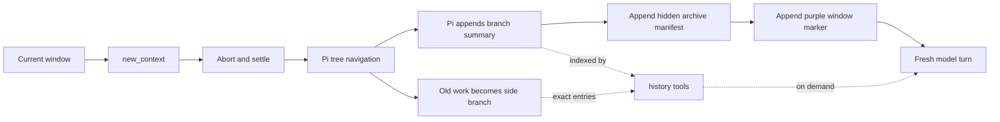

# Tree context management

Status: implemented contract. Keep this file synchronized with the runtime.

## Outcome

Add a provider-independent **Tree** context-management mode that uses Pi's append-only session tree to remove completed windows from the active branch. Pi-generated branch summaries remain in the session and UI but are filtered from model context. The existing Codex-shaped history and notes tools retrieve them and their archived raw entries on demand.

Tree mode preserves the same model semantics as the no-summary window flow:

- the next model window does not automatically receive a conversation summary
- the model receives the current window marker, previous window ID, recent note paths and bounded history IDs
- shell, workspace and Notebook runtime state survive rollover
- prior summaries and raw work are available only through history and notes
- Pi JSONL remains append-only and is never rewritten



## Mode model

Use four explicit choices:

| Mode | Storage and recovery | Provider contract |
| --- | --- | --- |
| **Off** | No context management | No context tools |
| **Local** | Current latest-boundary projection, Pi JSONL history and notes | Local tools; no remote calls |
| **Tree** | Pi side branches, hidden summaries and local note snapshots | Local retrieval; no remote calls |
| **Remote** | Codex history and notes service | Exact Codex namespaces, encrypted arguments and outputs; Codex transport only; no fallback |

Remote must either work as the native Codex feature or fail honestly. Users choose Local or Tree when they want provider-independent recovery.

Tree is a separate mode because its persisted topology differs from Local, not because the model sees different rollover semantics.

## Verified Pi machinery

The design was checked against canonical Pi source and the Pi 0.85.0 declarations used by this package.

### Command context capture

`ExtensionCommandContext` exposes `navigateTree()`; ordinary tool and event contexts do not. Pi creates one when an extension command runs.

An extension can invoke its own command without a provider turn:

```ts
pi.sendUserMessage("/internal-context-command", {
  expandPromptTemplates: true,
});
```

Pi dispatches extension commands before prompt-template expansion or provider execution. A captured command context remains valid while its extension runner remains active. It becomes stale after `/new`, `/resume`, `/fork`, `/reload`, replacement, or shutdown.

`bindExtensions()` binds command actions before emitting `session_start`. The capture command handler must assign the context synchronously and do no asynchronous work. Tree mode must refuse rollover safely if capture has not completed.

There is no hidden-command option. The bridge command will technically exist in Pi's command registry. A future Pi API exposing idle-safe tree navigation to ordinary extension contexts would remove this workaround.

Relevant Pi sources:

- `packages/coding-agent/src/core/extensions/types.ts`
- `packages/coding-agent/src/core/extensions/runner.ts`
- `packages/coding-agent/src/core/agent-session.ts`
- `packages/coding-agent/test/suite/agent-session-prompt.test.ts`
- `packages/coding-agent/test/suite/regressions/2860-replaced-session-context.test.ts`

### Navigation timing

`AgentSession.navigateTree()` rejects while the agent is streaming. Pi marks the run inactive before awaiting extension `agent_settled` handlers, making that event the first safe navigation point.

The rollover must run directly inside the awaited `agent_settled` handler. A timer or detached promise opens a race in which another prompt can begin against the old leaf.

`new_context` therefore becomes a two-phase operation:

1. validate and record a pending rollover
2. abort the current agent run
3. wait for `agent_settled`
4. perform tree navigation and append continuation state there

The exact abort point must be proven with a focused lifecycle prototype. The triggering tool call, its result and custom messages deferred until turn end must either be included in the archived interval or deliberately replayed. Do not infer this ordering from tool-handler return order.

### Append-only tree

`SessionManager.branchWithSummary()` moves the leaf to the selected branch point and appends a `branch_summary`. Existing entries remain untouched in the same JSONL file. The summary carries:

- `id`: summary entry ID
- `parentId`: branch cut
- `fromId`: abandoned leaf
- `summary`: model-generated summary
- `details`: built-in summary metadata when present

The normal Pi summarizer can generate the summary during `navigateTree(..., { summarize: true })`. This keeps summarization owned by Pi and avoids inventing another agent tool.

Selecting a user or custom-message target navigates to its parent and returns its content as `editorText`. Because a context boundary is a custom message, the coordinator must save editor text before navigation and restore it afterwards.

Relevant Pi sources:

- `packages/coding-agent/src/core/agent-session.ts`
- `packages/coding-agent/src/core/session-manager.ts`
- `packages/coding-agent/test/agent-session-tree-navigation.test.ts`
- `packages/coding-agent/test/branch-summary-extensions.test.ts`

## Persisted representation

### Native branch summary

Use Pi's ordinary `branch_summary`; do not replace it with a custom summary entry. It remains visible in Pi's transcript and tree.

Pi's default branch summarizer does not let an extension add our details after creation, and session entries are immutable. Append a model-invisible companion manifest immediately after navigation:

```ts
{
  customType: "codex-context-tree-archive",
  data: {
    protocol: 1,
    strategy: "codex-context-tree",
    windowId,
    boundaryEntryId,
    summaryEntryId,
    archivedLeafId,
    branchBaseId
  }
}
```

`summaryEntryId`, `archivedLeafId` and `branchBaseId` must agree with the native summary's `id`, `fromId` and `parentId`. Treat malformed or cyclic pointers as unavailable archives, never as permission to walk arbitrary entries.

### Note snapshot

Local note entries written during the completed window move onto the abandoned side branch. Before navigation, materialize the current logical note state. After navigation, append a model-invisible note snapshot to the new active branch before starting the next turn.

Future note writes reconstruct from:

1. the latest active-branch snapshot
2. later write and append entries on that branch

Do not copy raw conversation entries into the snapshot. Bound file sizes using the existing local-notes limits.

### Window marker

After the archive manifest and note snapshot, append the existing purple context-window custom message. It is the last model-visible session entry and starts the continuation turn.

The marker retains:

- first window ID
- current window ID
- previous window ID
- zero-based window number
- up to five recent note paths
- the available previous summary and recent user item IDs

Tree navigation removes the previous boundary from the active branch, so the pending rollover must carry identity forward instead of rebuilding it only from the newly active branch.

## Filtering

Pi converts every active `branch_summary` into a model-visible branch-summary message. Tree mode must remove only summaries owned by this feature.

At `session_start`, `session_tree` and before each context projection:

1. scan the active branch for valid `codex-context-tree-archive` manifests
2. resolve each referenced native summary entry
3. validate its `fromId`, `parentId`, summary ID and session ancestry
4. build a signature from summary ID plus `fromId`, summary text and timestamp
5. remove matching branch-summary messages from the provider context

Do not remove manual Pi branch summaries or summaries created by other extensions.

Tree mode must not run the current “slice from latest boundary” projection. The active tree path already performs the cut. Its context handler should:

- filter marked Tree summaries
- omit model-invisible archive and note entries naturally
- retain the latest purple boundary for developer-message promotion
- retain current-window user, assistant and tool messages

Filtering is reconstructed from persisted entries. An in-memory set may cache the index but cannot be authoritative after resume or tree navigation.

## Retrieval index

Build a `TreeArchiveIndex` from all session entries, not only `getBranch()`.

For each valid manifest:

1. resolve the associated branch summary
2. begin at `archivedLeafId`
3. follow parent pointers towards `branchBaseId`
4. stop before the branch base
5. reverse the collected entries into chronological order
6. normalize them with the existing local-history renderer

Apply hard bounds to traversal depth, output characters and item count. Reject cycles, missing parents and cross-archive mismatches locally.

The summary itself is a searchable history item. Its text is never injected automatically. The next window receives its opaque item ID so the model can read it directly instead of listing the archived window.

### Codex-shaped operations

Keep the existing model contract:

- `list_windows` returns opaque window IDs and item counts
- `list_items` returns the hidden summary followed by normalized raw entries
- `search_contents` searches summary text first, then exact archived entries
- `read_item` reads a bounded range from either a summary or raw item

Summary-first search gives the model a compressed index while raw entries preserve exact recovery. Returned IDs remain opaque and are accepted unchanged by later calls. Manual summaries and unrelated branches never enter this index.

The current window is read from the active branch. Archived windows are read through manifests. Multiple rollovers therefore look like:

```text
summary₁ → manifest₁ → summary₂ → manifest₂ → current boundary → current work
```

The summaries and manifests remain active ancestors, but only the current boundary and work reach the model.

## Rollover coordinator

Maintain one pending rollover per session:

```ts
{
  sessionId,
  boundaryEntryId,
  windowIdentity,
  leafIdAtRequest,
  requestedAt
}
```

### Tool phase

`new_context` in Tree mode:

1. verifies command-context capture, a current boundary entry and no existing pending rollover
2. records the current session ID, leaf and window identity
3. calls `ctx.abort()`
4. returns a bounded “rollover scheduled” result

It must not append the next boundary while the old turn is streaming.

### Settled phase

The `agent_settled` handler:

1. atomically takes the pending rollover
2. confirms session ID and expected ancestry
3. captures editor text
4. materializes note state
5. calls `navigateTree(boundaryEntryId, { summarize: true, ... })`
6. records the returned summary in an archive manifest
7. appends the note snapshot
8. starts the next context window
9. restores editor text

No work may be deferred through a timer.

### `session_tree` interaction

Our current generic `session_tree` handler resets Notebook tree epochs and shuts down the Code/Notebook host. An internal context rollover must be distinguished from user tree navigation:

- internal rollover preserves shell and Notebook runtime state
- ordinary user navigation keeps the existing Notebook reset behavior
- internal navigation must not auto-create a boundary before the manifest and note snapshot exist

Pi emits `session_tree` before command-context navigation returns. Its interactive wrapper may then flush input queued during summarization. The final append and turn-trigger ordering must be proven in the lifecycle prototype. The safe design may need to append manifest, note snapshot and boundary from the synchronous `session_tree` handler, then trigger continuation only after every required entry is present.

Only the last emitted model-visible entry may trigger a turn.

## Automatic model behavior

Tree mode should require no new model tool and no user command.

The next window receives the same context guidance and notes bootstrap as Local and Remote. Tree adds bounded opaque IDs for its hidden summary and recent user requests. The model reads known items directly or searches for a specific missing detail; it must not enumerate the archived window. The history and notes operations preserve Codex names, action names, opaque-ID flow and result shapes. Host-side tree indexing is invisible to the model.

Transport constraints still apply:

- Remote mode can expose exact native Codex namespaces with encrypted fields.
- Tree and Local use plaintext local execution.
- Codex transport must keep stable flat `history` and `notes` routers for local execution because its reserved namespaces require encrypted arguments.
- Other compatible Responses transports may receive the equivalent namespaced operations.

Do not add a Tree-specific retrieval tool or Tree-specific standing prompt.

## Resume, switching and manual compaction

On resume with Tree mode enabled:

- capture a fresh command context
- rebuild archive and notes indexes from JSONL
- restore the latest active boundary identity
- leave all archived side branches untouched

With Tree mode disabled, tagged summaries remain ordinary persisted Pi summaries but our provider filter and retrieval tools disappear. Because the summaries were intentionally hidden from the managed model, sessions are not guaranteed to continue correctly without the feature.

The existing “run `/compact` before disabling” escape path needs Tree-specific treatment. Manual compaction while Tree mode is active must materialize a readable cumulative summary from archived summaries plus the current window. The fixed no-summary compaction marker is insufficient for leaving Tree mode.

User navigation into an archived branch is ordinary tree navigation, not an internal rollover. It resets Notebook state as it does today, rebuilds indexes for the selected branch and initializes a fresh context boundary if required.

## Cache and accounting

Tree navigation changes the active tail while retaining the prefix up to the branch cut. The hidden summary and archive entries are removed before provider serialization, so a new model window contains only its boundary and live work.

Expected effects:

- provider cache is intentionally broken at rollover, as with other context resets
- stable ancestry before the branch cut may remain reusable where the provider permits it
- Pi's active tree and provider context agree, avoiding the current projection-only accounting mismatch
- usage becomes authoritative after the first response in the new window

Measure the actual emitted prompt and tool schemas again after implementation.

## Failure policy

Prevent or stop on invalid state:

- missing or stale command context
- rollover requested while another is pending
- session changed between tool and settled phase
- missing boundary or archived leaf
- ancestry mismatch, missing parent or cycle
- navigation cancellation or summary failure
- inability to persist manifest, note snapshot or boundary

On failure, preserve the old active branch whenever Pi has not completed navigation. If navigation has completed, do not start a model turn until the new branch contains enough recovery state. Surface one concise UI error and leave the session inspectable.

Never silently fall back from Remote to Local or Tree.

## Implementation map

Likely ownership:

- `adapter/activation/config.ts` and settings UI: expose Tree and Remote
- `context-management/window-manager.ts`: boundary entry IDs, pending identities and Tree projection
- new `context-management/tree-coordinator.ts`: command capture, abort/settled state machine and internal-navigation guard
- new `context-management/tree-archive.ts`: manifest validation, bounded traversal and index rebuild
- `context-management/local-history.ts`: active and archived window sources
- `context-management/local-notes.ts`: snapshots across branch cuts
- `context-management/tools.ts`: Tree-mode `new_context` scheduling
- `extension/events.ts`: capture, `agent_settled`, `session_tree`, context filtering and shutdown cleanup
- `adapter/provider-request.ts` and namespace tools: exact Remote versus plaintext Local/Tree routing
- README and settings warning: mode semantics and safe exit

Keep tree machinery out of provider transports. It is Pi session lifecycle, not transport behavior.

## Validation plan

The focused lifecycle proof against Pi 0.85.0 must cover:

1. the internal command captures a working `ExtensionCommandContext` on startup and resume
2. `new_context` aborts and reaches exactly one `agent_settled`
3. navigation archives the exact bounded interval
4. the tool call, result and deferred custom entries are not lost
5. manifest, note snapshot and boundary are appended in deterministic order
6. only the final continuation starts a turn
7. editor text survives
8. input submitted during summarization lands after the new boundary
9. internal rollover preserves Notebook state
10. ordinary user tree navigation still resets Notebook state

Then protect the independent contracts:

- index reconstruction after resume
- summary filtering without touching manual branch summaries
- bounded and cycle-safe archive traversal
- summary-first search and exact item reads
- note snapshot reconstruction
- repeated rollovers
- mode routing for Off, Local, Tree and Remote
- Remote failure without fallback
- manual compaction exit from Tree mode

Use focused checks while iterating and the package umbrella gate once after review. Do not turn the test suite back into a lifecycle tour.

## Verified choices

1. The tool aborts only after recording the pending rollover. Pi persists its tool result before emitting `agent_settled`.
2. Navigation runs directly in the awaited `agent_settled` handler; the final boundary triggers only after the summary, manifest and note snapshot exist.
3. Input submitted during navigation is intercepted and replayed as follow-up input after the new boundary.
4. Pi's default branch-summary instructions are sufficient; Tree adds no standing prompt or Tree-specific model tool.
5. Remote mirrors the native namespace schemas, encrypted sensitive arguments and encrypted output contract. A live enabled account remains the final backend acceptance check.

Canonical source, checked-in regression tests and installed 0.85.0 API declarations agree on the lifecycle mechanics above.
